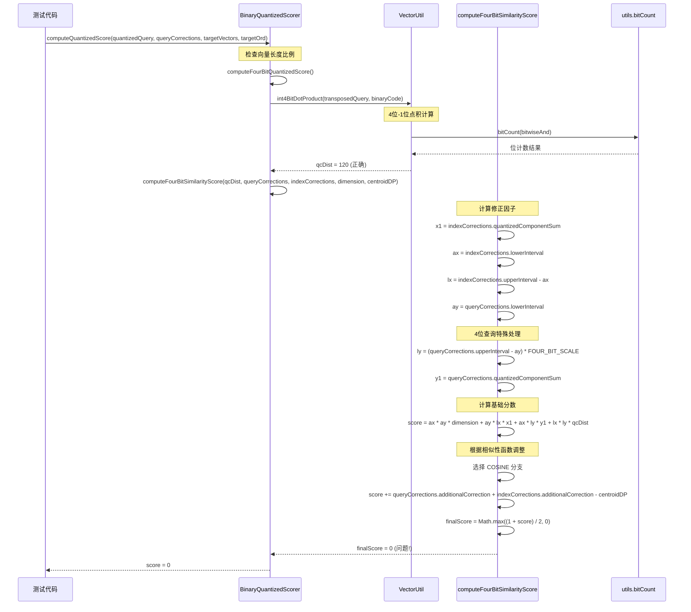

# 4位查询相似性分数计算调用序列分析

## 调用序列图

## 问题分析

### 1. 数据流验证
- ✅ **4位-1位点积计算**: qcDist = 120 (正确)
- ✅ **向量长度检查**: 4:1 比例正确
- ✅ **位平面索引**: 正确访问4个位平面

### 2. 相似性分数计算问题
从调用序列可以看出，问题出现在 `computeFourBitSimilarityScore` 函数中：

1. **修正因子计算**: 可能存在问题
2. **基础分数计算**: `score = ax * ay * dimension + ay * lx * x1 + ax * ly * y1 + lx * ly * qcDist`
3. **余弦相似性调整**: `finalScore = Math.max((1 + score) / 2, 0)`

### 3. 可能的问题点

#### 3.1 修正因子问题
- `ax`, `ay`, `lx`, `ly` 的计算可能不正确
- `FOUR_BIT_SCALE` 的应用可能有问题

#### 3.2 基础分数计算问题
- 各项的符号可能不正确
- 数值范围可能导致溢出或下溢

#### 3.3 余弦相似性调整问题
- `Math.max((1 + score) / 2, 0)` 可能将正常分数截断为0

## 调试建议

1. **添加中间值调试**: 在 `computeFourBitSimilarityScore` 中打印所有中间计算结果
2. **验证修正因子**: 检查 `ax`, `ay`, `lx`, `ly`, `x1`, `y1` 的值
3. **检查基础分数**: 验证 `score` 的计算过程
4. **对比Java实现**: 确保与Java原版的逻辑完全一致

## 下一步行动

1. 在 `computeFourBitSimilarityScore` 中添加详细的调试信息
2. 对比Java原版的 `quantizedScore` 方法
3. 验证修正因子的计算逻辑
4. 检查余弦相似性的调整公式 