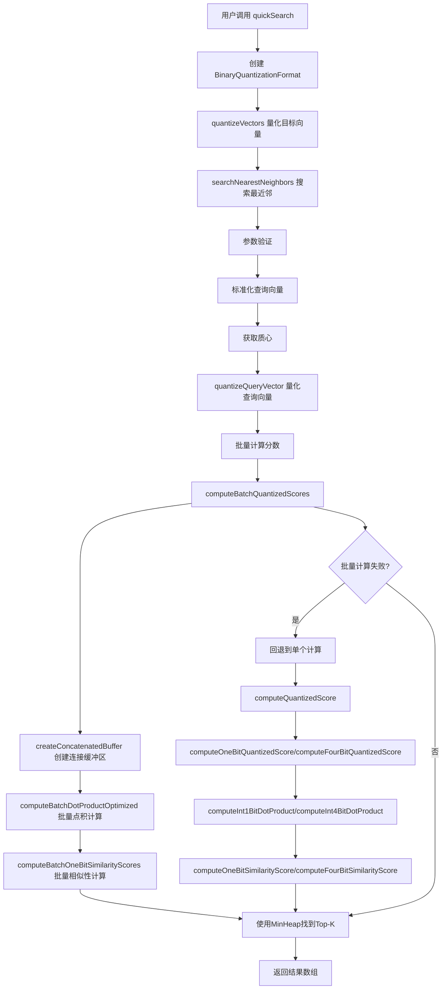

# 二值量化查询过程调用图

## 概述

本文档详细描述了二值量化系统中的查询过程，从用户调用到最终返回结果的完整调用链。

## 主要入口点

### 1. 快速搜索接口
```typescript
// src/index.ts
export function quickSearch(
  queryVector: Float32Array,
  targetVectors: Float32Array[],
  k: number,
  similarityFunction: VectorSimilarityFunction = VectorSimilarityFunction.COSINE
)
```

### 2. 二值量化格式搜索
```typescript
// src/binaryQuantizationFormat.ts
public searchNearestNeighbors(
  queryVector: Float32Array,
  targetVectors: BinarizedByteVectorValues,
  k: number
): Array<{ index: number; score: number; originalScore?: number; }>
```

## 完整调用流程图



## 详细调用层次

### 第一层：用户接口
```
quickSearch()
├── 创建 BinaryQuantizationFormat 实例
├── quantizeVectors() - 量化目标向量集合
└── searchNearestNeighbors() - 执行搜索
```

### 第二层：搜索核心逻辑
```
searchNearestNeighbors()
├── 参数验证
├── 标准化查询向量（余弦相似度）
├── 获取质心
├── quantizeQueryVector() - 量化查询向量
├── 批量计算分数
└── MinHeap排序找到Top-K
```

### 第三层：量化处理
```
quantizeQueryVector()
├── 计算查询向量与质心的点积
├── 使用OptimizedScalarQuantizer量化
└── 返回量化查询向量和修正因子
```

### 第四层：批量计算
```
computeBatchQuantizedScores()
├── createConcatenatedBuffer() - 创建连接缓冲区
├── computeBatchDotProductOptimized() - 八路循环展开点积计算
├── computeBatchOneBitSimilarityScores() - 批量相似性计算
└── 构建结果数组
```

### 第五层：点积计算
```
computeBatchDotProductOptimized()
├── 八路循环展开主循环
├── 处理剩余字节
└── 返回点积结果数组
```

### 第六层：相似性计算
```
computeBatchOneBitSimilarityScores()
├── 遍历所有向量
├── 计算相似性分数
└── 返回分数数组
```

## 关键数据结构

### 1. 量化结果
```typescript
interface QuantizationResult {
  centroidDP: number;      // 质心点积
  queryCorrection: number; // 查询修正因子
  indexCorrection: number; // 索引修正因子
}
```

### 2. 量化评分结果
```typescript
interface QuantizedScoreResult {
  score: number;           // 最终相似性分数
  bitDotProduct: number;   // 位运算点积
  corrections: {
    query: QuantizationResult;
    index: QuantizationResult;
  };
}
```

### 3. 二值化向量值
```typescript
interface BinarizedByteVectorValues {
  dimension(): number;                    // 向量维度
  size(): number;                        // 向量数量
  vectorValue(ord: number): Uint8Array;  // 获取向量值
  getUnpackedVector(ord: number): Uint8Array; // 获取未打包向量
  getCorrectiveTerms(ord: number): QuantizationResult; // 获取修正因子
  getCentroidDP(queryVector?: Float32Array): number; // 获取质心点积
  getCentroid(): Float32Array;           // 获取质心
}
```

## 性能优化策略

### 1. 批量处理
- 使用1000个向量的批量大小
- 减少函数调用开销
- 提高缓存利用率

### 2. 八路循环展开
- 在点积计算中使用八路循环展开
- 减少循环开销
- 提高CPU指令流水线效率

### 3. 内存优化
- 使用TypedArray存储分数和索引
- 避免不必要的对象创建
- 重用数组避免重复分配

### 4. 缓存机制
- LRU缓存未打包向量
- 缓存转置查询向量
- 限制缓存大小避免内存泄漏

### 5. 错误回退
- 批量计算失败时回退到单个计算
- 确保算法稳定性
- 保持结果一致性

## 量化策略

### 1. 非对称量化
- 查询向量：4位量化
- 索引向量：1位量化
- 平衡精度和性能

### 2. 质心中心化
- 计算所有向量的质心
- 从每个向量中减去质心
- 提高量化精度

### 3. 修正因子
- 计算量化误差的修正因子
- 在相似性计算中应用修正
- 提高最终分数精度

## 相似性函数支持

### 1. 余弦相似度
- 标准化向量
- 使用点积计算相似度
- 结果范围：[-1, 1]

### 2. 欧几里得距离
- 计算向量间距离
- 转换为相似度分数
- 结果范围：[0, ∞)

### 3. 最大内积
- 直接使用点积
- 应用缩放函数
- 结果范围：[0, ∞)

## 错误处理

### 1. 参数验证
- 检查向量维度匹配
- 验证k值有效性
- 确保输入数据完整性

### 2. 回退机制
- 批量计算失败时回退
- 保持功能可用性
- 记录警告信息

### 3. 边界条件
- 处理空向量集合
- 处理k=0的情况
- 处理单个向量的情况

## 性能监控

### 1. 关键指标
- 查询响应时间
- 内存使用量
- 缓存命中率
- 批量计算成功率

### 2. 优化建议
- 根据数据规模调整批量大小
- 监控缓存效果
- 定期清理缓存
- 分析性能瓶颈

## 总结

二值量化查询过程是一个高度优化的多层级调用链，通过批量处理、循环展开、内存优化和缓存机制实现了高效的向量搜索。系统支持多种相似性函数，具有完善的错误处理和回退机制，能够在保证精度的同时提供优异的性能表现。 