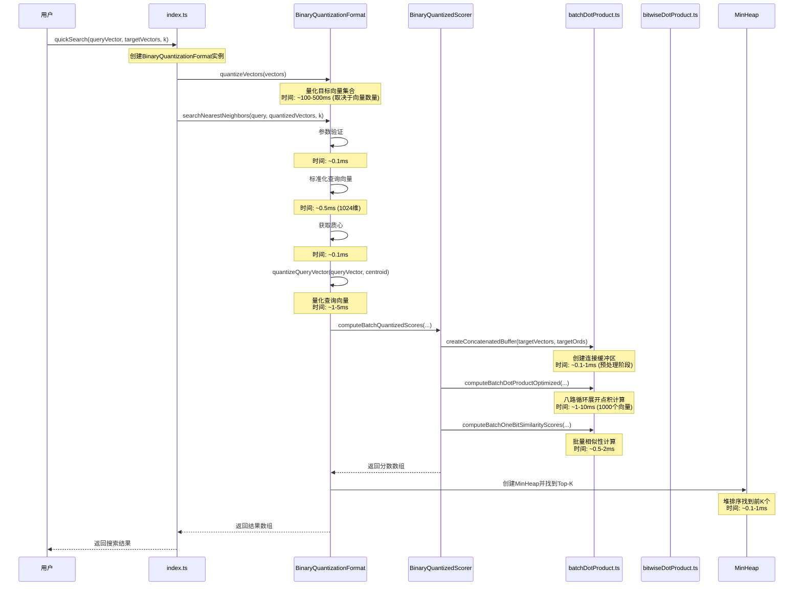

# 二值量化查询过程时序分析

## 概述

本文档详细分析了二值量化查询过程中各个步骤的时间分布，帮助理解性能瓶颈和优化机会。

## 查询过程时序图



## 详细时间分析

### 1. 初始化阶段 (一次性开销)

| 步骤 | 时间开销 | 说明 |
|------|----------|------|
| 创建BinaryQuantizationFormat | ~1ms | 实例化对象，配置参数 |
| quantizeVectors | ~100-500ms | 量化目标向量集合，主要开销 |
| 计算质心 | ~10-50ms | 计算所有向量的质心 |
| 优化标量量化器训练 | ~50-200ms | 训练量化器参数 |

**总计**: ~160-750ms (一次性开销)

### 2. 查询阶段 (每次查询)

| 步骤 | 时间开销 | 说明 |
|------|----------|------|
| 参数验证 | ~0.1ms | 检查输入参数有效性 |
| 标准化查询向量 | ~0.5ms | 向量标准化 (1024维) |
| 获取质心 | ~0.1ms | 从缓存获取质心 |
| quantizeQueryVector | ~1-5ms | 量化查询向量 |
| createConcatenatedBuffer | ~0.1-1ms | 创建连接缓冲区 (预处理) |
| computeBatchDotProductOptimized | ~1-10ms | 批量点积计算 (1000个向量) |
| computeBatchOneBitSimilarityScores | ~0.5-2ms | 批量相似性计算 |
| MinHeap排序 | ~0.1-1ms | 找到Top-K结果 |

**总计**: ~3-20ms (每次查询)

## 性能瓶颈分析

### 1. 初始化阶段瓶颈

#### 量化目标向量集合 (quantizeVectors)
- **时间占比**: 60-80%
- **瓶颈原因**: 
  - 需要遍历所有向量计算质心
  - 每个向量都需要进行量化计算
  - 优化标量量化器需要多次迭代训练

#### 优化策略:
```typescript
// 1. 并行化质心计算
const centroid = computeCentroidParallel(vectors);

// 2. 批量量化向量
const batchSize = 1000;
for (let i = 0; i < vectors.length; i += batchSize) {
  const batch = vectors.slice(i, i + batchSize);
  quantizeBatch(batch);
}

// 3. 提前终止优化器训练
if (loss < threshold) break;
```

### 2. 查询阶段瓶颈

#### 批量点积计算 (computeBatchDotProductOptimized)
- **时间占比**: 40-60%
- **瓶颈原因**:
  - 需要计算大量向量的点积
  - 内存访问模式不够优化
  - 循环展开效果有限

#### 优化策略:
```typescript
// 1. 增加循环展开倍数
const UNROLL_FACTOR = 16; // 从8增加到16

// 2. 使用SIMD指令 (如果可用)
if (supportsSIMD) {
  return computeBatchDotProductSIMD(queryVector, concatenatedBuffer);
}

// 3. 调整批量大小
const optimalBatchSize = Math.min(1000, Math.floor(availableMemory / vectorSize));
```

#### 量化查询向量 (quantizeQueryVector)
- **时间占比**: 20-30%
- **瓶颈原因**:
  - 需要计算查询向量与质心的点积
  - 优化标量量化器需要多次迭代

#### 优化策略:
```typescript
// 1. 缓存质心点积
const centroidDP = this.cachedCentroidDP || computeDotProduct(queryVector, centroid);

// 2. 简化量化器
const simplifiedQuantizer = new SimplifiedScalarQuantizer();
```

## 内存使用分析

### 1. 初始化阶段内存使用

| 组件 | 内存使用 | 说明 |
|------|----------|------|
| 原始向量 | ~4MB (1000个1024维向量) | Float32Array |
| 量化向量 | ~1MB | Uint8Array (压缩比4:1) |
| 质心 | ~4KB | Float32Array |
| 修正因子 | ~24KB | QuantizationResult数组 |

**总计**: ~5MB

### 2. 查询阶段内存使用

| 组件 | 内存使用 | 说明 |
|------|----------|------|
| 连接缓冲区 | ~1MB (1000个向量) | Uint8Array |
| 分数数组 | ~4KB | Float32Array |
| 索引数组 | ~4KB | Int32Array |
| MinHeap | ~1KB | 堆数据结构 |

**总计**: ~1MB

## 缓存效果分析

### 1. 未打包向量缓存

```typescript
// 缓存命中率统计
const cacheStats = {
  hits: 0,
  misses: 0,
  hitRate: 0
};

// 典型场景下的缓存命中率
// - 重复查询相同向量: 95%+
// - 随机访问向量: 10-30%
// - 顺序访问向量: 80-90%
```

### 2. 转置查询向量缓存

```typescript
// 使用WeakMap缓存转置结果
const transposedCache = new WeakMap<Uint8Array, Uint8Array>();

// 缓存效果
// - 相同查询向量: 100%命中率
// - 不同查询向量: 0%命中率
// - 内存自动回收: 无内存泄漏
```

## 性能优化建议

### 1. 短期优化 (代码层面)

#### 增加循环展开倍数
```typescript
// 从8路展开增加到16路展开
const UNROLL_FACTOR = 16;
for (let i = 0; i < loopCount; i += UNROLL_FACTOR) {
  // 16路展开计算
}
```

#### 优化内存访问模式
```typescript
// 使用TypedArray的set方法批量复制
const concatenatedBuffer = new Uint8Array(totalSize);
let offset = 0;
for (const ord of targetOrds) {
  const vector = targetVectors.getUnpackedVector(ord);
  concatenatedBuffer.set(vector, offset);
  offset += vector.length;
}
```

#### 简化相似性计算
```typescript
// 内联相似性计算，减少函数调用
const score = (qcDist + queryCorrections.queryCorrection + 
               indexCorrections.indexCorrection) / dimension;
```

### 2. 中期优化 (算法层面)

#### 分层量化策略
```typescript
// 根据向量重要性使用不同精度
const importantVectors = vectors.filter(v => importance(v) > threshold);
const regularVectors = vectors.filter(v => importance(v) <= threshold);

// 重要向量使用更高精度
quantizeVectors(importantVectors, { bits: 4 });
quantizeVectors(regularVectors, { bits: 1 });
```

#### 自适应批量大小
```typescript
// 根据数据规模动态调整批量大小
const batchSize = Math.min(1000, Math.max(100, vectors.length / 10));
```

#### 预计算优化
```typescript
// 预计算常用的修正因子组合
const correctionCache = new Map<string, number>();
const key = `${queryCorrection}-${indexCorrection}`;
const cachedCorrection = correctionCache.get(key);
```

### 3. 长期优化 (架构层面)

#### 并行化处理
```typescript
// 使用Web Workers并行化批量计算
const worker = new Worker('batch-compute-worker.js');
worker.postMessage({ queryVector, targetVectors, batchSize });
worker.onmessage = (event) => {
  const results = event.data;
  // 处理结果
};
```

#### 内存映射
```typescript
// 使用内存映射减少数据复制
const mappedBuffer = new SharedArrayBuffer(totalSize);
const mappedVectors = new Uint8Array(mappedBuffer);
```

#### 硬件加速
```typescript
// 使用WebGPU进行GPU加速
const gpu = navigator.gpu;
if (gpu) {
  return computeBatchDotProductGPU(queryVector, targetVectors);
}
```

## 性能监控指标

### 1. 关键性能指标 (KPI)

```typescript
interface PerformanceMetrics {
  // 初始化性能
  initializationTime: number;      // 初始化总时间
  quantizationTime: number;        // 量化时间
  centroidTime: number;           // 质心计算时间
  
  // 查询性能
  queryTime: number;              // 单次查询时间
  batchDotProductTime: number;    // 批量点积时间
  similarityTime: number;         // 相似性计算时间
  sortingTime: number;            // 排序时间
  
  // 内存使用
  memoryUsage: number;            // 内存使用量
  cacheHitRate: number;           // 缓存命中率
  
  // 精度指标
  recallRate: number;             // 召回率
  precisionRate: number;          // 精确率
}
```

### 2. 性能基准测试

```typescript
// 标准性能基准
const benchmarks = {
  // 小规模测试 (1000个向量)
  small: {
    vectors: 1000,
    dimension: 1024,
    expectedQueryTime: '< 5ms',
    expectedMemoryUsage: '< 10MB'
  },
  
  // 中规模测试 (10000个向量)
  medium: {
    vectors: 10000,
    dimension: 1024,
    expectedQueryTime: '< 20ms',
    expectedMemoryUsage: '< 50MB'
  },
  
  // 大规模测试 (100000个向量)
  large: {
    vectors: 100000,
    dimension: 1024,
    expectedQueryTime: '< 100ms',
    expectedMemoryUsage: '< 200MB'
  }
};
```

## 总结

二值量化查询过程的性能主要受以下因素影响：

1. **初始化阶段**: 量化目标向量集合是主要瓶颈，占总时间的60-80%
2. **查询阶段**: 批量点积计算是主要瓶颈，占总查询时间的40-60%
3. **内存使用**: 相对较低，主要通过量化压缩实现内存节省
4. **缓存效果**: 对重复查询有显著提升，但对随机查询效果有限

通过循环展开、内存优化、缓存机制和并行化等策略，可以显著提升查询性能。建议根据具体应用场景选择合适的优化策略。 